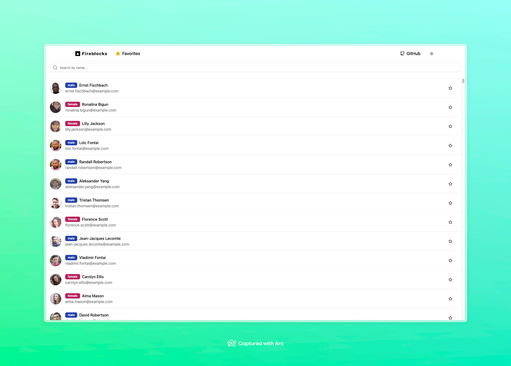
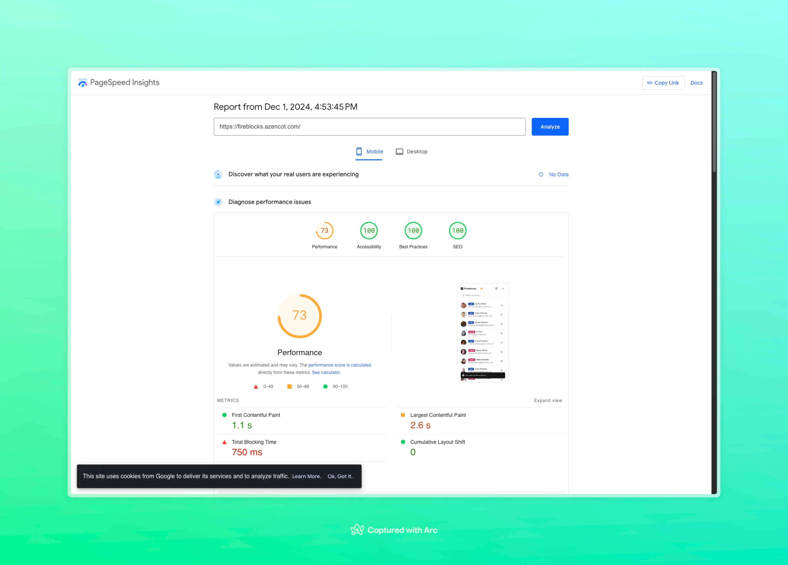

# User Management Application

### Performance Note
The performance score is lower mainly due to the low API speed and the fact that it serves low-quality images. I didn't bother finding a more efficient API for this purpose.

## Technology Stack & Architecture

This application is built using modern web technologies and practices:

### Frontend Stack
- **Vite** - For fast development and optimized builds
- **TypeScript** - For type safety and better developer experience
- **React** - UI framework
- **shadcn/ui** - Component library that enables AI tooling integration (v0.dev compatibility)
- **MobX** - State management for reactive data handling
- **Sonner** - Toast notifications system
- **react-window** - Efficiently rendering large lists and tables
- **pnpm** - Fast, disk space efficient package manager

### Infrastructure
- **Docker** - Application containerization
- **Hetzner** - Cloud hosting provider
- **Dokploy** - CI/CD pipeline management
- **Traefik** - Edge router handling SSL/HTTPS termination and routing
- **Vercel** - Serverless deployment platform
- **AWS Lambda** - Serverless compute (used by Vercel)
- **Cloudflare** - CDN and edge network

## Design Choices

### Why These Technologies?

1. **Vite + TypeScript**
   - Fast HMR (Hot Module Replacement)
   - Type safety and better IDE support
   - Modern build tooling

2. **shadcn/ui**
   - Customizable components
   - AI tooling compatibility (v0.dev)
   - Consistent design system
   - Accessible components out of the box

3. **MobX**
   - Simple and scalable state management
   - Reactive updates
   - Easy integration with React

4. **react-window**
   - Efficiently handles rendering of large lists and tables
   - Improves performance by only rendering visible items
   - Smaller bundle size and simpler API compared to `react-virtualized` (developed by the same person)

5. **randomuser.me**
   - Provides a simple API for generating random user data
   - Useful for testing and development purposes

6. **Infrastructure**
   - Dual deployment strategy:
     - Containerized deployment with Docker on Hetzner
     - Serverless deployment on Vercel with AWS Lambda
   - Automated deployments via Dokploy for container version
   - SSL/HTTPS security via Traefik and Vercel
   - Multiple CDN implementations with Cloudflare
   - High availability across different hosting solutions

## Deployments

The application is deployed in two environments:

1. **Containerized Deployment**
   - Hosted on Hetzner (https://fireblocks.azencot.com/)
   - Managed through Docker and Dokploy
   - Uses Traefik for routing and SSL
   - Cloudflare integration for CDN and performance optimization
   - Implements Cloudflare Rocket Loader for faster JavaScript loading

2. **Serverless Deployment**
   - Hosted on Vercel (https://serverless-fireblocks.azencot.com/)
   - Leverages AWS Lambda for serverless computing
   - Utilizes Cloudflare's CDN for optimal performance
   - Zero configuration SSL/HTTPS

### Prerequisites
- Node.js (v18 or higher)
- pnpm
- Docker (for containerized deployment)
